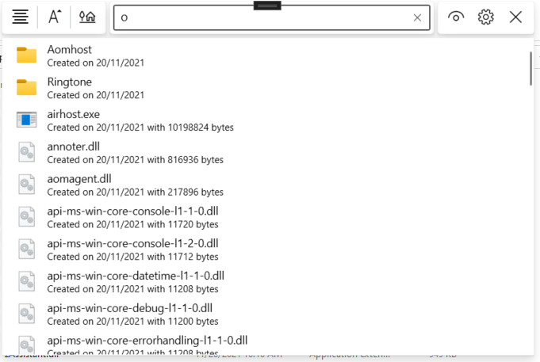

<div id="top"></div>

<br />


<div>
  <h3 >IFilterShellView - Shell Extension</h3>
  <p>
    Another tool designed to help you survive in the windows world
    <br />
    <a href="IFilterShellView/Demo">View Demo</a>
    ·
    <a href="https://github.com/Aeindus/IFilterShellView/issues">Report Bug</a>
    ·
    <a href="https://github.com/Aeindus/IFilterShellView/issues">Request Feature</a>
  </p>
</div>

<br clear="left"/>


## About The Project

[![IFilterShellView Product Screenshot][product-screenshot]](https://github.com/Aeindus/IFilterShellView)

The windows explorer is not a `simple` piece of software built by Microsoft. It is rather a quite complicated system that includes the tools and exposes the interfaces required so as to make development and integration a not that hard of a process. All that is required is access to documentation and code samples that /lead the way/. With that knowledge at hand the explorer is as customizable as it could be - to some extent - of course. 


However, windows namespace extensions are not developed - Microsoft lacks the will and developers lack both knowledge and will :-)

The `IFilterShellView` is an extension built for the windows explorer that improves the searching experience and allows a broader spectrum of actions to be performed on the filtered folders and files. The following methods of filtering items are suported at the time:
* Via text placement (e.g in the beggining or ending or in the middle of the text)
* Via regular expresion
* Via parsed command that supports filtering via attributes (e.g dates, size, type, extension, ...) as well as the above

The methods can be extended and will be in the future with your support and feedback. The plugin extends the normal behaviour of the windows explorer and minimizes the time you would usually spend searching for items. Moreover it is built using controls that feel native to the windows ecosistem and integrate with the current installed theme. It is a theme aware project which means you don't have to worry for a bright light during the night.

<p align="right"><a href="#top">back to top</a></p>


## Installing the binaries
To install the latest version of the plugin `IFilterShellView` you have to download the latest binaries from <a href="https://github.com/Aeindus/IFilterShellView/releases/tag/published">the release page</a> and install them. You can choose to either download the installer or download the portable version.

### Warning
If you choose to `upgrade` to a newer version then you must uninstall the previous version. Only afterwards you may proceed with the process of installing the newer version.

## Getting Started
After the intallation is complete, run the recently installed image named distinctively `IFilterShellView.exe`. It can be found inside the installation folder (either the default one or the one set by you during the installation). 

To `/summon/` the instance of `IFilterShellView` 
* Bring forward a new explorer window and navigate to a folder populated with items. 
* Press the hotkey `CTRL+F`. A nice window should popup on top of the explorer window.

## Gallery view - theme awareness
Light view
<br>

<br>
Dark view
<br>


### Warning
`IFilterShellView` can only filter through items that have a physical corespondent on the disk. In other words you cannot filter through elements of a virtual folder inside the namespace such as `My Computer` or `This PC` or `Control Panel` etc.


### How to use

With the `IFilterShellView` filter window now open, start typing a search query inside the text input and results with matched data will start showing up. As an item is matched against your search query, it is automatically selected inside the explorer window. That means that after the searching is done you can move/copy/rename all the selected items from the explorer window. 


Example of a search query:

In the image above you can observe the results of a search query. 

Actions that can be performed on a query result item:
* Right click - invokes a context menu
* Left click - makes the explorer window navigate to the selected item (if item is a folder) or opens the items with the default associated handler
* `Selecting and dragging` to another window performs a `drag-and-drop` to the target window.

<br>

### How to do a complex query
If a text placement query or a regex query won't help you, then you can invoke the `xpress parser` via the command symbol `?`. When the parser encounters that symbol it will know that the query that follows will be a special command.
To obtain the list of available commands installed with the binary, click on the button `Show list of available commands` that can be found inside the far-right command bar.

Example of a command query
```bash
? older 10/10/2022
# or
? older 10/10/2022 & newer 5/5/2015               # older that X date and newer than Y date
# or 
? o 10/10/2022 & n 5/5/2015 | ( start "Test" )    # notice that "o" is an alias for the "older" command
# or 
? o 10/10/2022 & n 5/5/2015 | ( s "Test" ) & file # notice that "s" is an alias for the "start"-with command
# or
? o 10/10/2022 & n 5/5/2015 | s Test & file       # if the argument won't contain white spaces then quotes are not necesary
# or any other combination
```
`Warning!` If you don't specify a logical grouping then the conditions will be parsed in the order they appear in.

### Download the project's source code

Bellow you can see the steps required to get the code on your machine and get it running

1. Clone the repository
```sh
git clone https://github.com/Aeindus/IFilterShellView.git
```
2. Browse to the solution
```sh
cd IFilterShellView
```
4. Run `ExplorerFilter.sln` to start the project


<p align="right"><a href="#top">back to top</a></p>


## Contributing

See the [open issues](https://github.com/Aeindus/IFilterShellView/issues) for a full list of proposed features (and known issues).

Contributions are what make the open source community such an amazing place to learn, inspire, and create. Any contributions you make are **greatly appreciated**.

If you have a suggestion that would make this better, please fork the repo and create a pull request. You can also simply open an issue with the tag "enhancement".
Don't forget to give the project a star! Thanks again!

1. Fork the Project
2. Create your Feature Branch (`git checkout -b feature/AmazingFeature`)
3. Commit your Changes (`git commit -m 'Add some AmazingFeature'`)
4. Push to the Branch (`git push origin feature/AmazingFeature`)
5. Open a Pull Request

<p align="right"><a href="#top">back to top</a></p>


## License

Distributed under the GPL-2.0 License. See `LICENSE.txt` for more information.

## Contact

Aiendus - aiendus.inc@gmail.com
Project Link: [https://github.com/Aeindus/IFilterShellView](https://github.com/Aeindus/IFilterShellView)

_Note 1_: This is a free and opensource project. Consider a donation to suport this project. 

_Note 2_: If you intend to create a similar project or to modify this one - with the purpose of obtaining profit - then leave me a message.

_Note 3_: If the @PowerToys team decides to deprecate this project and include it along it's other tools then it'd be nice if I'd be contacted too.
<p align="right"><a href="#top">back to top</a></p>


<!-- ACKNOWLEDGMENTS -->
## Acknowledgments

List of resources that I found helpful and would like to give credit to. I've included a few of my favorites to kick things off!

* [ModernWPF Toolkit](https://github.com/Kinnara/ModernWpf)
* [GitHub Pages](https://pages.github.com)

<p align="right"><a href="#top">back to top</a></p>


<!-- MARKDOWN LINKS & IMAGES -->
[product-screenshot]: Gallery/screenshot.png