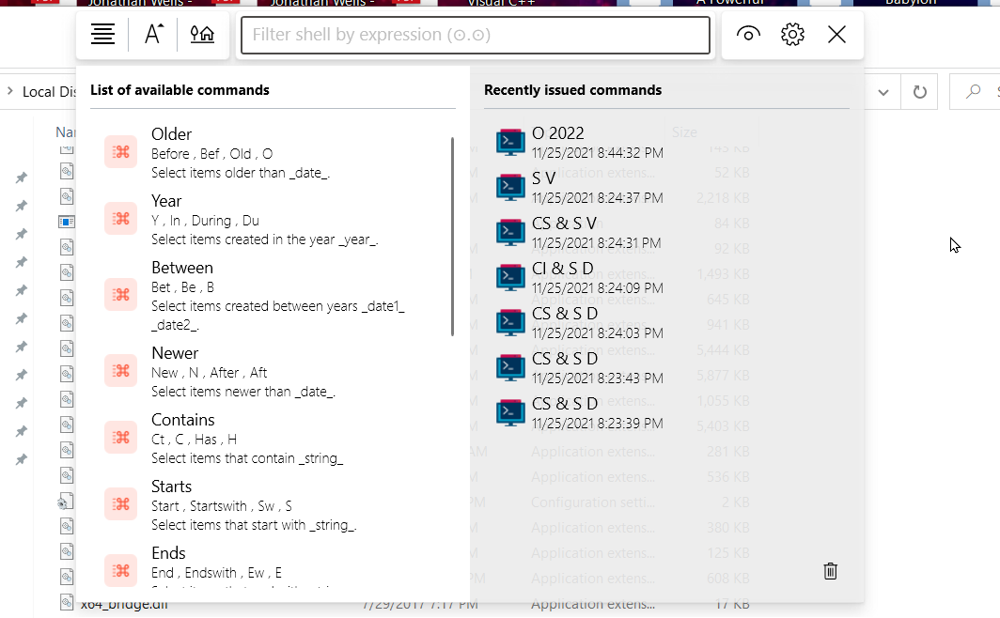

<div id="top"></div>

<!--
*** I'm using markdown "reference style" links for readability.
*** Reference links are enclosed in brackets [ ] instead of parentheses ( ).
*** See the bottom of this document for the declaration of the reference variables
*** This is an optional, concise syntax you may use.
*** https://www.markdownguide.org/basic-syntax/#reference-style-links
-->


<br />


<div>
  <h3 >IFilterShellView - Shell Extension</h3>
  <p>
    Another tool designed to help you survive in the windows world
    <br />
    <a href="IFilterShellView/Demo">View Demo</a>
    ·
    <a href="https://github.com/Aeindus/IFilterShellView/issues">Report Bug</a>
    ·
    <a href="https://github.com/Aeindus/IFilterShellView/issues">Request Feature</a>
  </p>
</div>

<br clear="left"/>


<!-- ABOUT THE PROJECT -->
## About The Project

[![IFilterShellView Product Screenshot][product-screenshot]](https://github.com/Aeindus/IFilterShellView)

There are not that many great features built into the window's explorer. It is true however that the explorer is not in fact a `simple` program built by Microsoft. It is rather a quite complicated system that includes the tools and exposes the interfaces required so as to make development and integration a not that hard of a process. All that is required is access to documentation and code samples that /lead the way/. With that knowledge at hand the explorer is as customizable as it could be - to some extent - of course. 


However, windows namespace extensions are not developed - Microsoft lacks the will and developers lack both knowledge and will :-)

The `IFilterShellView` is an extension built for the windows explorer that improves the searching experience and allows a broader spectrum of actions to be performed on the filtered folders and files. The following methods of filtering items are suported at the time:
* Via text placement (e.g in the beggining or ending or in the middle of the text)
* Via regular expresion
* Via parsed command that supports filtering via attributes (e.g dates, size, type, extension, ...) as well as the above

The methods can be extended and will be in the future with your support and feedback. The plugin extends the normal behaviour of the windows explorer and minimizes the time you would usually spend searching for items. Moreover it is built using controls that feel native to the windows ecosistem and integrate with the current installed theme. It is a theme aware project which means you don't have to worry for a bright light during the night.

<p align="right"><a href="#top">back to top</a></p>


## Installing the binaries
To install the latest version of the plugin `IFilterShellView` you have to download the latest binaries from <a href="https://github.com/Aeindus/IFilterShellView/releases/tag/published">the release page</a> and install them. You can choose to either download the installer or download the portable version.

### Warning
If you choose to `upgrade` to a newer version then you must uninstall the previous version. Only afterwards you may proceed with the process of installing the newer version.

## Getting Started
After the intallation is complete, run the recently installed image named distinctively `IFilterShellView.exe`. It can be found inside the installation folder (either the default one or the one set by you during the installation). To `/summon/` the instance of `IFilterShellView` bring forward a new explorer window and navigate to a folder populated with items. Then press the hotkey `CTRL+F`. A nice window should popup on top of the explorer window (/nice/ is subjectively expressed).




### Warning
`IFilterShellView` can only filter through items that have a physical corespondent on the disk. In other words you cannot filter through elements of a virtual folder inside the namespace such as `My Computer` or `This PC` or `Control Panel` etc.


### Prerequisites

This is an example of how to list things you need to use the software and how to install them.
* npm
```sh
npm install npm@latest -g
```

### Installation

_Below is an example of how you can instruct your audience on installing and setting up your app. This template doesn't rely on any external dependencies or services._

1. Get a free API Key at [https://example.com](https://example.com)
2. Clone the repo
```sh
git clone https://github.com/your_username_/Project-Name.git
```
3. Install NPM packages
```sh
npm install
```
4. Enter your API in `config.js`
```js
const API_KEY = 'ENTER YOUR API';
```

<p align="right"><a href="#top">back to top</a></p>


<!-- USAGE EXAMPLES -->
## Usage

Use this space to show useful examples of how a project can be used. Additional screenshots, code examples and demos work well in this space. You may also link to more resources.

_For more examples, please refer to the [Documentation](https://example.com)_

<p align="right"><a href="#top">back to top</a></p>


<!-- ROADMAP -->
## Roadmap

- [x] Add Changelog
- [x] Add back to top links
- [] Add Additional Templates w/ Examples
- [] Add "components" document to easily copy & paste sections of the readme
- [] Multi-language Support
- [] Chinese
- [] Spanish

See the [open issues](https://github.com/othneildrew/Best-README-Template/issues) for a full list of proposed features (and known issues).

<p align="right"><a href="#top">back to top</a></p>


<!-- CONTRIBUTING -->
## Contributing

Contributions are what make the open source community such an amazing place to learn, inspire, and create. Any contributions you make are **greatly appreciated**.

If you have a suggestion that would make this better, please fork the repo and create a pull request. You can also simply open an issue with the tag "enhancement".
Don't forget to give the project a star! Thanks again!

1. Fork the Project
2. Create your Feature Branch (`git checkout -b feature/AmazingFeature`)
3. Commit your Changes (`git commit -m 'Add some AmazingFeature'`)
4. Push to the Branch (`git push origin feature/AmazingFeature`)
5. Open a Pull Request

<p align="right"><a href="#top">back to top</a></p>


<!-- LICENSE -->
## License

Distributed under the MIT License. See `LICENSE.txt` for more information.

<p align="right"><a href="#top">back to top</a></p>


<!-- CONTACT -->
## Contact

Your Name - [@your_twitter](https://twitter.com/your_username) - email@example.com

Project Link: [https://github.com/your_username/repo_name](https://github.com/your_username/repo_name)

<p align="right"><a href="#top">back to top</a></p>


<!-- ACKNOWLEDGMENTS -->
## Acknowledgments

Use this space to list resources you find helpful and would like to give credit to. I've included a few of my favorites to kick things off!

* [Choose an Open Source License](https://choosealicense.com)
* [GitHub Emoji Cheat Sheet](https://www.webpagefx.com/tools/emoji-cheat-sheet)
* [Malven's Flexbox Cheatsheet](https://flexbox.malven.co/)
* [Malven's Grid Cheatsheet](https://grid.malven.co/)
* [Img Shields](https://shields.io)
* [GitHub Pages](https://pages.github.com)
* [Font Awesome](https://fontawesome.com)
* [React Icons](https://react-icons.github.io/react-icons/search)

<p align="right"><a href="#top">back to top</a></p>


<!-- MARKDOWN LINKS & IMAGES -->
<!-- https://www.markdownguide.org/basic-syntax/#reference-style-links -->
[product-screenshot]: Gallery/screenshot.png